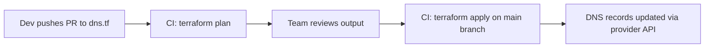

# 📘 Project 13 – GitOps DNS Repo

A Git-backed repository that defines and manages DNS zones using Terraform, version control, and GitOps workflows.

This project focuses on treating DNS as a version-controlled, declarative, reviewable system — where every DNS change goes through Git and CI/CD.

---

## 🧭 Overview

Manual DNS updates via UI or CLI don’t scale.

GitOps fixes this by:

- Defining all DNS zones/records in Terraform
- Storing them in a Git repository
- Using CI/CD pipelines (or manual approval) to validate and apply changes
- Optionally using ArgoCD or Terraform Cloud for deployment

This project will mirror real-world patterns from companies using GitOps for:

- Infrastructure DNS
- Internal service discovery
- Multi-environment rollouts

---

## 🛠 Tech Stack

- Terraform 1.5+
- Git
- Cloud provider (Cloudflare, Route53)
- GitHub / GitLab
- Optional:
  - Terraform Cloud or Atlantis for automation
  - ArgoCD (for K8s DNS integration)

---

## 🎯 Goals

- Build a Git-first repo to manage DNS state
- Use pull requests for all DNS changes
- Track, review, and revert DNS changes with history
- Work with multiple environments (dev, prod)
- Prepare for a future GitOps controller integration

---

## 📄 Example DNS Record (Terraform)

```hcl
resource "cloudflare_record" "api_dev" {
  zone_id = cloudflare_zone.packet_guide.id
  name    = "api-dev"
  type    = "A"
  value   = "10.0.1.5"
  ttl     = 120
  proxied = false
}
```

---

## 📂 Project Structure

```
environments/
├── dev/
│   ├── dns.tf
│   ├── variables.tf
│   └── terraform.tfvars
├── prod/
│   ├── dns.tf
│   └── terraform.tfvars

modules/
└── dns_zone/
    ├── main.tf
    ├── variables.tf
    └── outputs.tf

.gitops/
├── pre-commit-check.sh
└── ci/terraform-validate.yml

README.md
```

---

## 🚀 Getting Started

1. Clone this project as a standalone Git repo (or use a monorepo):

```bash
git clone https://github.com/your-username/packet-guide.com.git
cd packet-guide.com/projects/13_gitops_dns_repo
```

2. Set up Terraform + secrets:

```bash
export CLOUDFLARE_API_TOKEN="..."
terraform init
```

3. Validate changes:

```bash
terraform plan
```

4. Apply only after review:

```bash
terraform apply
```

---

## 🔁 GitOps Workflow Example



---

## 🧠 What I Learned

To reflect post-build:

- How Git becomes your infrastructure change ledger
- Best practices for Terraform folder structure
- DNS rollout strategies (TTL changes, gradual swaps)
- Versioning, testing, and rollback of DNS records

---

## ✍️ Related Blog Ideas

- “DNS as Git: What I Learned Moving to GitOps”
- “Building a Reviewable, Declarative DNS Workflow with Terraform”
- “Pull Requests for DNS? Yes Please.”

---

## 🔁 Next Steps

- Add CI/CD for validate + apply (GitHub Actions, GitLab CI)
- Use Terraform Cloud workspace per environment
- Add documentation generator for DNS zone layout
- Integrate with ArgoCD (for K8s DNS views)
